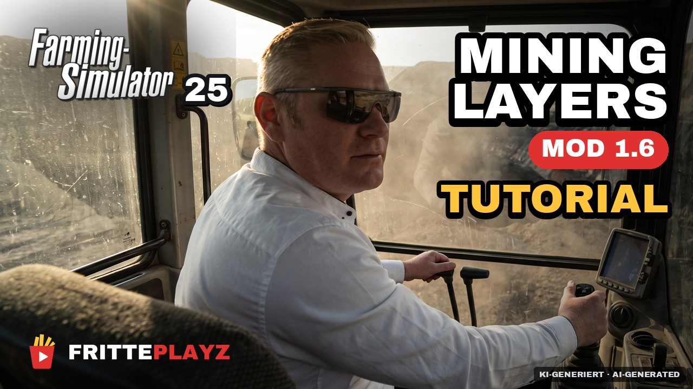
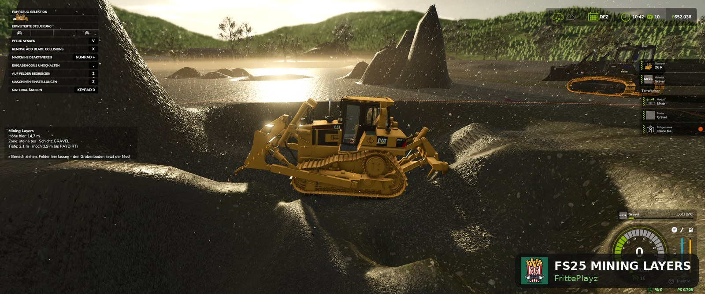
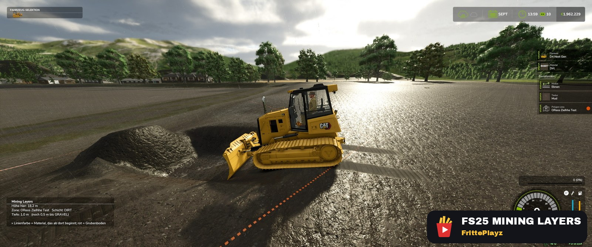

# Mining Layers (FS25)

[](https://github.com/FrittePlayz/FS25_MiningLayers/releases/latest)
[](https://github.com/FrittePlayz/FS25_MiningLayers/releases)
[](#)
[](https://buymeacoffee.com/fritteplayz)


**Echtes Bergbau-Gameplay für den Landwirtschafts-Simulator 25 — grab dich durch geologische Schichten, oder bau deine eigene Kiesgrube im LS25.**
Das Material bestimmt die Grabtiefe, nicht die Handauswahl: erst Mutterboden, dann Kies, dann Paydirt, dann Fels. Seit 1.4.0 ist die Nutzschicht wählbar — Kohlegrube, Kiesgrube oder Kalksteinbruch, auf jeder Karte. Eigene Geologie pro Grube, Halden mit Gedächtnis und ein Ingame-Editor. Läuft auf **jeder Karte** — ohne Map-Bearbeitung. **Mod und Ingame-Handbuch gibt es vollständig auf Deutsch, Englisch, Französisch, Polnisch, Italienisch und Portugiesisch.**

Mining Layers baut auf **[TerraFarm](https://github.com/scfmod/FS25_TerraFarm)** von scfmod auf und benötigt es zum Laufen. Inoffizielles Addon, keine Verbindung zu scfmod.

🇬🇧 [English](README.md) · 🇫🇷 [Français](README.fr.md) · 🇵🇱 [Polski](README.pl.md) · 🇮🇹 [Italiano](README.it.md) · 🇵🇹 [Português](README.pt.md)

**[Video](#video-tutorial) · [Voraussetzungen](#voraussetzungen--zuerst-lesen) · [Installation](#installation) · [Erste Grube](#schritt-für-schritt-deine-erste-grube) · [FAQ](#faq) · [Changelog](#changelog) · [Roadmap](#roadmap)**

---

## Video-Tutorial

[](https://www.youtube.com/watch?v=kR0h1_S8oHc)

29 Minuten, von der Installation bis zum Dozer: Bodenslots, Zielhöhe, der Sonderfall Wasser — und Graben ohne gezeichnete Area. Untertitel auf Deutsch, Englisch, Französisch, Polnisch, Italienisch und Portugiesisch.

---

## Voraussetzungen — zuerst lesen

1. **TerraFarm** — gibt es **nur auf GitHub**: [scfmod/FS25_TerraFarm](https://github.com/scfmod/FS25_TerraFarm).
   ⚠️ Den Ordner **nicht umbenennen** — er muss `FS25_0_TerraFarm` heißen (Ladereihenfolge).
2. **Mindestens eine Maschine mit TerraFarm-Config** — TerraFarm arbeitet nur mit Maschinen, die eine Machine-Konfiguration haben.
3. Empfohlen (kein Muss): eine Bergbau-Karte wie **Yukon (RGC)**. Mining Layers macht aber *jede* Karte zur Mining-Karte, auch Standard-Maps.

## Installation

1. Neuestes `FS25_MiningLayers.zip` aus den [Releases](../../releases) laden.
2. Die **ZIP-Datei unverändert** (nicht entpacken!) in den Mods-Ordner legen:
   - **Windows:** `Dokumente\My Games\FarmingSimulator2025\mods\`
   - **Steam unter Linux (Proton):** im Proton-Prefix — `<dein Steam-Stamm>/steamapps/compatdata/2300320/pfx/drive_c/users/steamuser/Documents/My Games/FarmingSimulator2025/mods/`. Der Steam-Stamm unterscheidet sich je Installation (`~/.local/share/Steam`, `~/.steam/debian-installation`, …); der Teil ab `compatdata/2300320` ist fest.
3. Sicherstellen, dass [TerraFarm](https://github.com/scfmod/FS25_TerraFarm) (`FS25_0_TerraFarm`) im selben Ordner liegt.
4. Spiel starten und **beide Mods** in der Mod-Auswahl des Spielstands anhaken.

Nach dem Start findest du eine neue Seite **Mining Layers** im ESC-Menü — mit der kompletten Anleitung direkt im Spiel:


## Schritt für Schritt: deine erste Grube

**1. TerraFarm-Bereich (Polygon) um die geplante Grube ziehen.** Das ist die ganze Einrichtung — die Bezugshöhe holt sich der Mod automatisch vom Gelände am Bereichsrand:


**2. Losgraben.** Das Mining-Layers-Panel links zeigt Zone, aktuelle Schicht, Tiefe — und wie weit es bis zur nächsten Schicht ist:


**3. Tiefer graben: Mutterboden → Kies → Paydirt → Fels.** Der Grubenboden stoppt automatisch unter der letzten Schicht:


**4. Eigene Schichten festlegen — pro Grube.** ESC-Menü → Mining Layers → Reiter Schichten. Unter *Gilt für* wählst du das Ziel: alle Bereiche als Standard oder eine bestimmte Grube — und ob diese Grube überhaupt mit Schichten arbeitet. Darunter stellst du Material und Dicke je Schicht ein, links siehst du das entstehende Profil sofort:


**5. Halden merken sich ihr Material.** Kies abkippen, Kies wiederaufnehmen — auch an den Flanken. Das Panel sagt dir, wenn das Halden-Gedächtnis greift. Kein Material-Cheaten: unter der Haldenbasis ist wieder Geologie:


**6. Bergbau am Berg lohnt sich.** Am Steilhang liegt Paydirt oberflächennah — die Belohnung für die Anfahrt:


**7. Die Grenzen kennen.** Gruben an der Wasserlinie laufen optisch voll (perfekt fürs Goldwaschen-Gefühl); manche Karten sperren Flussbett und Kartenrand komplett:


**8. Auch der Dozer kommt in die zweite Schicht.** Nur mit dem Schild — Modus *Ebnen*, ohne Heckaufreißer. Die Bahn lang genug machen: Je länger der Zug, desto tiefer geht es pro Durchgang:



**9. ★ Auf eine genaue Höhe planieren — die Zielhöhe ist dein Boden.** Trag im Bereichseditor von
TerraFarm den Grubenboden ein, und der Dozer planiert bis auf diese Höhe und hört dort auf. Eine
ebene Fläche auf Geländeniveau, eine Berme auf halber Grubenhöhe, eine Rampe mit festem Gefälle —
die Höhe, die du einträgst, ist die Höhe, die du bekommst. **Neu in 1.6:** Bis 1.5.0 hat der Mod
diesen Wert selbst nach unten gezogen, sobald er nahe am Geländeniveau lag — aus der geplanten
Ebene wurde eine Grube. Jetzt bleibt deine Zielhöhe stehen, und der Mod sagt nur noch im Log
Bescheid, wenn sie die unterste Schicht abschneidet. Gemeldet von TacticalOreo:
*„I was making a pad but it was not paying attention to the target height."*



## Jede Karte

Mining Layers läuft auf jeder Karte. Die Schicht-Texturen suchen sich automatisch die passendste Bodentextur, die die Karte anbietet (Standardnamen wie `GRAVEL`, `MOUNTAINROCK`, `MOSS_STONES`). Hat eine Karte nichts Passendes, bleibt einfach die eigene Texturauswahl aktiv — Materialien, Schichten und Halden funktionieren davon unabhängig. Beim ersten Graben schreibt der Mod die vollständige Texturliste der Karte ins Log, damit du eigene `paintLayer`-Vorgaben setzen kannst.

## ⚠️ Zwei Materialfelder je Bereich — das eine, was man richtig machen muss

Der häufigste Verwirrungspunkt überhaupt. Im TerraFarm-Menü → **Landscaping areas** → Bereich auswählen gibt es **zwei Materialfelder**: **Terraformen** und **Abladen** (gesetzt über *Material ändern*). Beide stehen ab Werk auf **„Not set"**.

1. **Beide Felder auf „Not set"** → Mining Layers arbeitet: Was in der Schaufel landet, hängt an der Grabtiefe. **Das ist der Auslieferungszustand eines frisch gezogenen Bereichs** — du musst nichts tun.
2. **Beim *Terraformen* ein Material eintragen** → der Bereich läuft als ganz normale TerraFarm-Polygon-Area ohne Schichten. Genau richtig für Baustellen, Straßenbau, Planieren — überall, wo du immer dasselbe Material brauchst.
3. Dasselbe geht über den **Reiter Schichten** von Mining Layers: unter *Gilt für* den Bereich wählen und auf „Normales TerraFarm" stellen.
4. **Pfad-Bereiche sind komplett ausgenommen** — Schichten gibt es ausschließlich in Polygon-Bereichen. Ein Pfad-Bereich verhält sich immer wie normales TerraFarm, egal was eingestellt ist.

Das ist **kein Defekt und kein Mod-Konflikt — es ist die vorgesehene Umschaltung.** Liefert eine Zone „das falsche Material", zuerst die Materialfelder des Bereichs prüfen.

## Features

- **Material nach Grabtiefe** — Schichtgrenzen in Metern unter der ursprünglichen Oberfläche
- **Geologie pro Grube** — jeder Bereich kann seinen eigenen Schichtaufbau haben, direkt im Ingame-Editor einstellbar (verschiedene Gruben, verschiedene Materialien, eine Karte)
- **Der Abraum gehört dir, das Flöz nicht** — einstellbar sind die Schichten über dem Paydirt-Flöz; Paydirt und Fels setzt der Mod selbst. Bewusst so: Das ist ein Bergbau-Mod, kein Materialautomat
- **Pro Grube: Schichten oder normales TerraFarm** — Zielbereich im Editor wählen und je Grube einzeln entscheiden
- **Halden-Gedächtnis** — was du abkippst, nimmst du auch wieder auf. Kein Material-Cheaten: Wer eine Halde unter ihre Basis durchgräbt, trifft wieder auf Geologie (Krater-Cheat-Sperre inklusive)
- **Automatischer Grubenboden** — Zieltiefe = unterste Schichtgrenze, zieht bei Bereichs-Änderungen nach
- **Hang- und Wasser-Behandlung** — geneigte Bezugsfläche am Hang, Grubenboden klemmt an der Wasserlinie
- **Eigene Menüseite** — grafischer Schichten-Editor plus vollständiges Ingame-Handbuch in allen sieben Sprachen
- **Tiefenanzeige & Tiefenlinien** — du weißt immer, wie tief du bist und was als Nächstes kommt; **Numpad /** schaltet die Anzeige ein/aus (im Spiel umbelegbar)
- **Material-Check beim Start** — sagt dir, wie viele Bodenplätze diese Karte bietet und welche Materialien leer ausgingen
- **Berg-Bonus** — am Steilhang liegt Paydirt oberflächennah: Wer die Anfahrt auf sich nimmt, wird belohnt

## Fallstricke, die man kennen sollte

**Schichtdicke: nicht zu dünn.** Der Editor erzwingt 1 m für die oberste Schicht und 1,5 m für jede darunter — dünnere Schichten brechen das Halden-Abtragen. **Bei großen Maschinen (PC-8000-Klasse) gräbt sich mit 2 m pro Schicht spürbar besser.**
- **Die Plätze für Bodenmaterialien sind begrenzt — durch die KARTE, nicht durch das Spiel.** Die Karte legt die Kanalbreite ihrer Höhen-Density-Map fest; die Zahl folgt 2^n-1, also 63 Plätze bei 6 Bit, 127 bei 7 Bit und 255 bei 8 Bit. Gemessen haben wir bisher: 63 auf einer 6-Bit-Karte (die Zahl nennt die Engine selbst) und 83 belegte Plätze auf einer 7-Bit-Karte, ohne eine einzige Ablehnung. 48 nimmt das Basisspiel, den Rest teilen sich Karte und Mods. Eine breit gebaute Karte hat also Platz, wo eine schmale keinen hat. Der Start-Check sagt dir, wo du stehst; `grep addDensityMapHeightType log.txt` nennt jedes Material, das leer ausging.
- **Absenken geht nur innerhalb des Polygons** (TerraFarm-Design). Ein Radlader schafft nur ~30–40 cm pro Ansatz — Rampe in die Grube fahren; der Bagger ist das Tiefen-Werkzeug.
- **Manche Karten sperren Terraforming** an Flussbett und Kartenrand (Engine-Sperrflächen). Da kommt kein Mod durch.
- Die Terrain-Texturnamen zur Laufzeit sind andere als in der `map.i3d` — der Mod löst das automatisch; pro Schicht per `paintLayer="..."` übersteuerbar.

## Konfiguration

`modSettings/FS25_MiningLayers/miningLayers.xml` — wird beim ersten Start aus der Vorlage angelegt und überlebt Mod-Updates. Schichtaufbau (Material + Tiefe, pro Bereich) und Anzeige-Optionen stehen hier. Alles auch über das Ingame-Menü editierbar.

### Eigene Geologie — Kiesgrube, Kohlerevier

Seit 1.4.0 ist die Nutzschicht im Editor wählbar (ESC-Menü → Mining Layers → Schichten): Sie ist die feste letzte Zeile — statt PAYDIRT gehen auch COAL, LIMESTONE, STONE, GRAVEL, SAND, DIRT oder SOIL. Ihre Lage bleibt fest: Die Nutzschicht liegt immer unter dem Abraum, der Fels darunter beendet die Grube.

Dasselbe pro Bereich in der XML:

```xml
<zone area="kiesgrube">
    <layer depth="1" fillType="DIRT" />
    <layer depth="7" fillType="LIMESTONE" seam="true" />
    <layer           fillType="STONE" />
</zone>

<zone area="kohlegrube">
    <layer depth="2"  fillType="DIRT" />
    <layer depth="6"  fillType="STONE" />
    <layer depth="12" fillType="COAL" seam="true" />
    <layer            fillType="STONE" />
</zone>
```

Ein Haken: PAYDIRT, COAL und LIMESTONE sind keine Basisspiel-Materialien — Karte, ein Mining-Mod oder ein anderer Mod muss sie mitbringen. Das Log listet beim Start alle Materialien der Karte; unbekannte werden mit Warnung übersprungen (und der Editor fällt auf PAYDIRT zurück, statt eine leere Grube zu speichern).

## FAQ

Direkt zur Frage:

1. [Läuft Mining Layers auf jeder Karte?](#1-läuft-mining-layers-auf-jeder-karte)
2. [Brauche ich einen neuen Spielstand?](#2-brauche-ich-einen-neuen-spielstand)
3. [Wie baue ich eine Kiesgrube im LS25?](#3-wie-baue-ich-eine-kiesgrube-im-ls25)
4. [Wie baue ich Kohle ab?](#4-wie-baue-ich-kohle-ab)
5. [Fügt Mining Layers meiner Karte ein Paydirt-Material hinzu?](#5-fügt-mining-layers-meiner-karte-ein-paydirt-material-hinzu)
6. [Kann ich eigene Schichten einstellen — mehr Erde, verschiedene Erdarten?](#6-kann-ich-eigene-schichten-einstellen--mehr-erde-verschiedene-erdarten)
7. [Warum gräbt mein Bagger nicht?](#7-warum-gräbt-mein-bagger-nicht)
8. [Warum bekomme ich immer dasselbe Material, egal wie tief ich grabe?](#8-warum-bekomme-ich-immer-dasselbe-material-egal-wie-tief-ich-grabe)
9. [Kann ich „überall" und gezogene Bereiche gleichzeitig benutzen? (1.6)](#9-kann-ich-überall-und-gezogene-bereiche-gleichzeitig-benutzen-16)
10. [Warum kommen keine Schichten, obwohl ich einen Bereich gezogen habe? (Top-3-Ursachen)](#10-warum-kommen-keine-schichten-obwohl-ich-einen-bereich-gezogen-habe-top-3-ursachen)
11. [Wie tief kann ich graben?](#11-wie-tief-kann-ich-graben)
12. [Wie dick sollten die Schichten sein?](#12-wie-dick-sollten-die-schichten-sein)
13. [Gibt es ein Halden-Limit — wie viel kann ich abkippen?](#13-gibt-es-ein-halden-limit--wie-viel-kann-ich-abkippen)
14. [Abladen auf den Boden bringt „Aktion nicht ausführbar"?](#14-abladen-auf-den-boden-bringt-aktion-nicht-ausführbar)
15. [Material liegt in der Schaufel, lässt sich aber nicht abkippen?](#15-material-liegt-in-der-schaufel-lässt-sich-aber-nicht-abkippen)
16. [Warum kippt meine Maschine nur in einem Bereich ab — oder nirgends?](#16-warum-kippt-meine-maschine-nur-in-einem-bereich-ab--oder-nirgends)
17. [Wie schalte ich die Tiefenanzeige aus (oder wieder ein)?](#17-wie-schalte-ich-die-tiefenanzeige-aus-oder-wieder-ein)
18. [Kann ich die Anzeige verschieben, damit sie nicht mit anderen HUD-Mods kollidiert?](#18-kann-ich-die-anzeige-verschieben-damit-sie-nicht-mit-anderen-hud-mods-kollidiert)
19. [Läuft das auf PS5 oder Xbox?](#19-läuft-das-auf-ps5-oder-xbox)
20. [Welche Sprachen gibt es?](#20-welche-sprachen-gibt-es)

---

#### 1. Läuft Mining Layers auf jeder Karte?

Ja. Keine Map-Bearbeitung nötig: TerraFarm-Bereich um die künftige Grube ziehen und losgraben. Für die Schicht-Texturen nimmt der Mod automatisch die passendste Bodentextur der Karte; passt keine, bleibt einfach deine eigene Texturauswahl aktiv.

#### 2. Brauche ich einen neuen Spielstand?

Nein. Mining Layers läuft mit bestehenden Savegames — installieren, beide Mods im Spielstand aktivieren, weiterspielen. Vorhandene TerraFarm-Bereiche funktionieren weiter; Bereiche ohne eingetragenes Material bekommen einfach Schichten.

#### 3. Wie baue ich eine Kiesgrube im LS25?

TerraFarm und Mining Layers installieren, TerraFarm-Bereich ziehen, dann ESC-Menü → Mining Layers → Schichten: DIRT oben, LIMESTONE oder STONE als Nutzschicht. Seit 1.4.0 ist das Flöz-Material direkt im Editor wählbar — ganz ohne XML.

#### 4. Wie baue ich Kohle ab?

COAL als Nutzschicht im Schichten-Editor wählen. Achtung: COAL ist kein Basisspiel-Material — Karte oder ein Mining-Mod muss es mitbringen (RGC-Karten wie Yukon Back Country haben es).

#### 5. Fügt Mining Layers meiner Karte ein Paydirt-Material hinzu?

Nein — der Mod registriert grundsätzlich keine Materialien. Er nutzt nur, was Basisspiel, Karte und deine anderen Mods schon mitbringen. PAYDIRT selbst ist kein Basisspiel-Material: Mining-Karten und Mining-Mods bringen es mit, deshalb ist es oft trotzdem da. Kein Paydirt im Spiel? Im Schichten-Editor eine Nutzschicht wählen, die deine Karte kennt — das Log listet beim Start alle auf.

#### 6. Kann ich eigene Schichten einstellen — mehr Erde, verschiedene Erdarten?

Ja, genau das ist das Kernfeature. ESC-Menü → Mining Layers → Schichten: Pro Grube wählst du Material UND Dicke jeder Abraum-Schicht. Mehr Erde? DIRT-Schicht auf 4 m statt 2. Abwechslung? DIRT über SOIL über Kies stapeln. Es geht alles, was deine Karte als Material kennt, und das Flöz unten ist ebenfalls wählbar. Mindestdicken: 1 m oben, 1,5 m darunter (mit großen Maschinen gräbt sich 2 m besser).

#### 7. Warum gräbt mein Bagger nicht?

TerraFarm braucht eine Maschinen-Konfiguration für das Fahrzeug — ohne passiert nichts (das liegt nicht an Mining Layers). Config-Paket installieren, z. B. scfmods FS25_TerraFarmMachines, und doppelte Maschinen-Einträge aus mehreren Paketen vermeiden.

#### 8. Warum bekomme ich immer dasselbe Material, egal wie tief ich grabe?

Im TerraFarm-Bereich ist ein Material eingetragen — damit läuft der Bereich als normales TerraFarm ohne Schichten (Absicht, für Baustellen). Materialfelder leer lassen, dann greifen die Schichten.

#### 9. Kann ich „überall" und gezogene Bereiche gleichzeitig benutzen? (1.6)

Ja, sie kommen sich nicht in die Quere. **Es entscheidet der Bereich, der der MASCHINE zugewiesen ist — nicht, wo du gerade stehst.**

- Maschine mit zugewiesenem Eingabe-Bereich → die Schichten dieses Bereichs.
- Maschine ohne Zuweisung → die globalen Schichten, überall auf der Karte.
- Bereich mit `enabled="false"` oder mit von Hand gesetztem Material → weiterhin keine Schichten, auch wenn global an ist. Baustellen und Rohrgräben bleiben sauber.

**Einschalten:** Eine frische Installation hat es schon an. Eine bestehende behält ihr Verhalten — einschalten unter **ESC → Mining Layers → Schichten**, Ziel **„Überall (ohne Bereich)"**, auf *Mining Layers* stellen, speichern. Wer stattdessen die `miningLayers.xml` von Hand ändert: `enabled="true"` setzen **und die `surfaceY`-Zeile löschen** — eine feste Bezugshöhe legt alle Schichten auf eine einzige Höhe und passt auf fast keine Karte. **Gar kein `globalZone`-Block in deiner Datei?** Das trifft jeden, der schon einmal im Schichten-Editor gespeichert hat — Speichern schreibt die Datei neu. Dann gibt es nichts von Hand zu ändern: den Schalter oben benutzen, der legt den Block an.

#### 10. Warum kommen keine Schichten, obwohl ich einen Bereich gezogen habe? (Top-3-Ursachen)

1. **Die Maschine hat keinen Eingabe-Bereich zugewiesen.** TerraFarm koppelt Bereiche an die MASCHINE, nicht an deine Position: Maschinen-Einstellungen (Standard `Y`) → deinen Bereich als Eingabe wählen. Wird pro Maschine und Spielstand gespeichert — der häufigste Support-Fall; TerraFarms HUD zeigt dann deinen Bereich statt nur ein Material.
2. **Im Bereich ist ein Material eingetragen** → der Bereich läuft absichtlich als normales TerraFarm (Baustellen-Modus). Materialfelder leer lassen.
3. **Du gräbst außerhalb des Bereichs-Polygons** (oder in einem Pfad-Bereich — Pfade bekommen nie Schichten).

#### 11. Wie tief kann ich graben?

Bis zum Fels unter der tiefsten Schicht — dort ist bewusst Schluss. Genau das macht es zum Bergbau statt zum bodenlosen Geldloch.

#### 12. Wie dick sollten die Schichten sein?

Mindestens 1,5 m (der Editor erzwingt 1 m für die oberste, 1,5 m darunter). Bei großen Maschinen wie dem PC 8000 gräbt sich mit 2 m pro Schicht spürbar besser.

#### 13. Gibt es ein Halden-Limit — wie viel kann ich abkippen?

Nein. Abgekipptes Material wird über TerraFarm zu echtem Gelände, nicht zu einem Basegame-Haufen — ein Haufen-Limit des Spiels greift also nicht. Das Halden-Gedächtnis ist ein 2-m-Raster pro Spielstand, ohne Deckel für Anzahl oder Größe. Einzige Eigenheit: Jede 2-m-Zelle merkt sich EIN Material (der letzte Abwurf gewinnt) — Materialien am selben Fleck nicht mischen, wenn du sie getrennt zurückholen willst.

#### 14. Abladen auf den Boden bringt „Aktion nicht ausführbar"?

TerraFarm prüft senkrecht unter der Schaufelkante: Liegt Terrain näher als etwa 0,5 m, ist Boden-Abladen gesperrt (Grab-Posen-Schutz). Es zählt der Abstand unter der Kante, nicht die Höhe des Auslegers — über einer ausgehobenen Vertiefung geht es auch mit tiefem Ausleger; auf flachem Boden kurz anheben, bis die Meldung verschwindet. Nach oben gibt es eine zweite Grenze: Der Abwurf muss noch Boden treffen. Also: Kante gut einen halben Meter frei, aber niedrig genug zum Abwerfen.

#### 15. Material liegt in der Schaufel, lässt sich aber nicht abkippen?

Wie viele Materialien auf dem Boden liegen können (height types), legt deine Karte fest, nicht das Spiel: entscheidend ist die Kanalbreite ihrer Höhen-Density-Map, nach 2^n-1 — 6 Bit ergeben 63 Plätze, 7 Bit ergeben 127, 8 Bit ergeben 255. Die 63 bestätigt die Engine in ihrer eigenen Fehlermeldung; auf einer 7-Bit-Karte haben wir 83 belegte Plätze ohne eine einzige Ablehnung gemessen, die Decke liegt dort also höher — ihr genauer Wert ist gerechnet, nicht gemessen. 48 belegt das Basisspiel bereits; die kartenzeigenen Materialien werden vor allen Mod-Materialien registriert, und was übrig bleibt, geht in Ladereihenfolge an die Modliste. Sind die Plätze einer Karte weg, verlieren spät registrierte Materialien ihren Platz: Sie funktionieren in der Schaufel und lassen sich verkaufen, aber nicht aufs Gelände kippen. Im Log steht dann `maximum number (63) of height types already registered` — eine Zeile je abgelehntem Material, `grep addDensityMapHeightType log.txt` gibt dir also die vollständige Liste. Seit 1.4.2 warnt der Mod pro Zone, wenn ein Schichtmaterial betroffen ist. Zwei Wege raus: materiallastige Mods ausmisten, oder eine Karte spielen, die mit mehr Kanälen gebaut wurde. Gemessenes Beispiel: auf einer 6-Bit-Karte wurden zehn Materialien abgelehnt, während dieselbe Modliste auf einer 7-Bit-Karte 83 height types registrierte, ohne eine einzige Ablehnung.

#### 16. Warum kippt meine Maschine nur in einem Bereich ab — oder nirgends?

Im Maschinen-Menü ist ein Ausgabe-Bereich zugewiesen: TerraFarm kippt dann nur dorthin. Seit 1.4.2 läuft eine Schicht-Zone als Ausgabe-Bereich automatisch frei (eine Log-Zeile sagt es). Für freies Abkippen überall den Ausgabe-Bereich der Maschine auf „Nicht gesetzt" stellen.

#### 17. Wie schalte ich die Tiefenanzeige aus (oder wieder ein)?

**Numpad /** drücken, solange eine Maschine aktiv ist (bis 1.4.3 war es Numpad 5). Die Taste ist umbelegbar: Optionen → Steuerung → Mining Layers. Soll die Anzeige von Anfang an aus sein: `showHeightDisplay="false"` in der `modSettings/FS25_MiningLayers/miningLayers.xml`.

#### 18. Kann ich die Anzeige verschieben, damit sie nicht mit anderen HUD-Mods kollidiert?

Ja — seit 1.4.2 **Num *** drücken (umbelegbar): Anzeige anklicken zum Aufnehmen, zweiter Klick legt ab, Rechtsklick setzt auf Standard zurück. Die Position speichert automatisch (liegt in `modSettings/FS25_MiningLayers/hud.xml`). Kein zusätzlicher HUD-Mod nötig.

#### 19. Läuft das auf PS5 oder Xbox?

Nein. Mining Layers ist ein Script-Mod, und Script-Mods laufen nur auf PC/Mac.

#### 20. Welche Sprachen gibt es?

Deutsch, Englisch, Französisch, Polnisch, Italienisch und Portugiesisch — inklusive komplettem Ingame-Handbuch.

## Übersetzungen

Mod und In-Game-Handbuch gibt es auf **Deutsch, Englisch, Französisch, Polnisch, Italienisch und Portugiesisch** (Italienisch von **marcols13**, Portugiesisch von **Alicopower**; FR/PL maschinell übersetzt — Korrekturen willkommen!). Welche Sprache soll als Nächstes kommen? **[Stimm in der Umfrage ab](https://github.com/FrittePlayz/FS25_MiningLayers/discussions/1)** — oder übersetz selbst: Die Sprachdateien sind einfaches XML (`l10n/`), kein Code nötig, und du wirst in den Credits genannt.

## Changelog

Jede Version mit ihren Änderungen: [CHANGELOG.md](CHANGELOG.md)

## Roadmap

Wohin der Mod geht. Das sind **Vorhaben, keine Versprechen** — keine Termine, und alles hier kann sich ändern oder wegfallen.

*Slot-Diagnose und Schichten ohne gezogenen Bereich sind mit 1.6.0 erschienen — siehe [Changelog](CHANGELOG.md).*

### v1.6.1 — Community / Oreo RGC Update

Zwei Wünsche aus dem RGC-Discord, rund eine Woche nach dem 1.6-Release.

- **Materialnamen in Materialfarbe** in der Höhenanzeige — dieselben Farben, die der Schichten-Editor schon nutzt.
- **Abraum-Modus** — alles über dem Flöz gräbt und kippt als *ein* Material, nur das Flöz bleibt echt. Löst das Problem, für jede durchgrabene Schicht einen eigenen Kipper zu brauchen.
- **Warnung vor der Schichtgrenze** — die Höhenanzeige nennt den Abstand zur nächsten Kante und färbt den Wert, je näher man kommt. Am Graben ändert das nichts; man sieht die Kante kommen, statt sie hinterher zu bemerken, wenn das falsche Material schon im Kipper liegt.

### FS25 Mining Layers-Director's Cut V2

Alles, was dich in die Grube bringt, steht in der Version darüber. Alles darunter ist Tiefe für die, die schon drinstehen, und kommt mit der nächsten großen Version.

1. **Editor** — die Materialien anbieten, die deine Karte tatsächlich mitbringt, statt Handarbeit in der `miningLayers.xml`; den Kartenbericht auf die Schichten-Seite holen; Halden sichtbar machen und je Zone zurücksetzen.
2. **Mehrspieler** — teilweise getestet. Der Mod läuft auf einem Dedicated Server: Zonen, Schichten und das Halden-Gedächtnis überstehen dort auch einen Neustart. Ungetestet ist die Client-Sicht — bis die geprüft ist, gilt Mehrspieler als unbewiesen.
3. **Materialhärte & passendes Werkzeug** — Fels soll sich nicht wie Erde graben: langsamer, oder erst nach Aufreißen/Hämmern. Zum Einordnen: Weder TerraFarm noch das Basisspiel kennen so etwas wie Materialhärte (der `hardness`-Wert des Engine-Pinsels ist die Randschärfe, nicht die Festigkeit) — das wird also kompletter Eigenbau.
4. **Ergiebigkeit** — magere Deckschicht, ergiebige Nutzschicht: mehr oder weniger Liter pro Kubikmeter, je nach Schicht.
5. **Deckgestein** — eine harte Zwischenschicht über dem Paydirt-Flöz, Kombination aus 4 und 3.
6. **Übergangsband an Schichtgrenzen** — eine kleine Toleranzzone, damit ein Werkzeug, das genau auf einer Grenze arbeitet, bei einem Material bleibt statt zwischen zweien hin- und herzuspringen (die Engine mag keine gemischten Materialien am Boden — danke an scfmod für den Hinweis in [#123](https://github.com/scfmod/FS25_TerraFarm/discussions/123)). Das Band wird im Schichten-Editor maßstäblich mitgezeichnet und erklärt sich damit selbst.
7. **Gemischte Schaufelladungen** — die Schaufel führt über eine Schichtgrenze hinweg ein Konto je Material (1.500 l Erde, 2.750 l Kies, 750 l Paydirt in einer 5.000-l-Ladung), statt beim Überschreiten der Kante schlagartig auf 100 % des neuen Materials zu springen. Abgekippt wird ein Mischmaterial, das eine Siebanlage wieder trennt. Vorschlag aus der Community.

### Begleitprojekt (eigener Mod, geplant)

**TerraFarm-Konfigurationen für die Basisspiel-Maschinen** — wer heute mit TerraFarm anfangen will, muss sich erst Mod-Bagger besorgen: Das offizielle Machines-Addon deckt Fremd-Mods ab, die Community-Packs ebenso. Niemand deckt ab, was das Spiel ohnehin mitbringt. Geplant ist ein Konfigurations-Addon für die Basisspiel-Flotte — Radlader, Teleskoplader, Frontlader samt Schaufeln, Schilden und Reißzähnen — damit jeder TerraFarm mit den Maschinen ausprobieren kann, die schon in der Halle stehen.

Es hat ein eigenes Repository — **[Dig With Anything](https://github.com/FrittePlayz/FS25_DigWithAnything)** (in Arbeit). Wenn eine Maschine mit TerraFarm arbeiten sollte und es nicht tut, nenn sie dort in den Issues.

Andere Meinung zur Reihenfolge oder eine Idee, die fehlt? [Diskussion oder Issue aufmachen](../../issues) — die Liste ist nicht in Stein gemeißelt.

## Sponsor

Mining Layers wird unterstützt von **[farmersingles.de](https://farmersingles.de)** — der Singlebörse für Landwirte. 🚜❤️
Das Sponsorschild am Grubenrand gibt es seit 1.6.1 nicht mehr — nichts mehr abzuschalten.

## Fehler & Fragen

Fehler gefunden? [Issue aufmachen](../../issues) — **immer die `log.txt` anhängen** (`Dokumente/My Games/FarmingSimulator2025/log.txt`, direkt nach dem Problem kopieren). Darin stehen deine komplette Modliste und der eigentliche Fehler — ohne sie können wir meistens nicht helfen. Feature-Ideen sind an derselben Stelle willkommen.

## Unterstütz den Mod 🍟

<p align="center">
  <a href="https://buymeacoffee.com/fritteplayz"></a>
</p>

Mining Layers ist bisher kostenlos — keine Paywall, keine Vorabversionen gegen Geld, keine Werbung.

Dahinter stecken viele Abende: TerraFarms Quelltext lesen, Testgruben ausheben und Fehler jagen, die erst beim fünften Neuladen auftauchen. Wenn dir der Mod einen guten Nachmittag in der Grube gemacht hat, **[spendier mir eine Portion Pommes](https://buymeacoffee.com/fritteplayz)** — die fließt direkt in Testzeit und neue Features.

Nicht dein Ding? Ein ⭐ auf dieses Repo, ein Fehlerbericht oder eine Empfehlung an einen Kumpel helfen genauso. Danke fürs Spielen!

## Credits

- **Autor:** Tommy Honold
- **Italienische Übersetzung:** **marcols13** — beigesteuert über [Discussion #1](https://github.com/FrittePlayz/FS25_MiningLayers/discussions/1), danke!
- **Portugiesische Übersetzung (pt/br):** **Alicopower** — beigesteuert über [Issue #7](https://github.com/FrittePlayz/FS25_MiningLayers/issues/7), danke!
- **Sponsor:** [farmersingles.de](https://farmersingles.de) — die Singlebörse für Landwirte
- Ein **[FrittePlayz](https://www.youtube.com/@FrittePlayz)**-Projekt (YouTube)
- Baut auf **[TerraFarm](https://github.com/scfmod/FS25_TerraFarm)** von scfmod auf (wird benötigt, separat installieren) — inoffizielles Addon, keine Verbindung zu scfmod oder GIANTS Software.
- HUD-Verschieben nach dem Vorbild von **HappyLoosers HL Hud System** (bekannt aus FS25_ProductionInfoHud) — eigene Implementierung, kein übernommener Code. Danke fürs offene Teilen des Systems!
