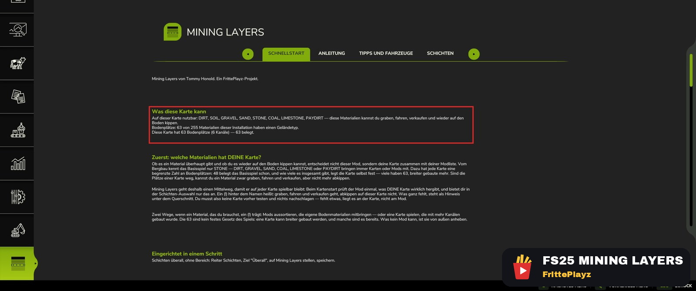
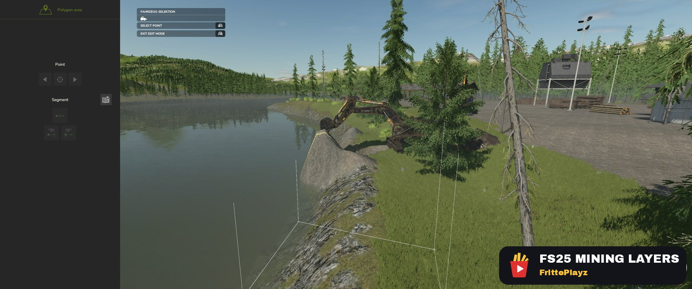
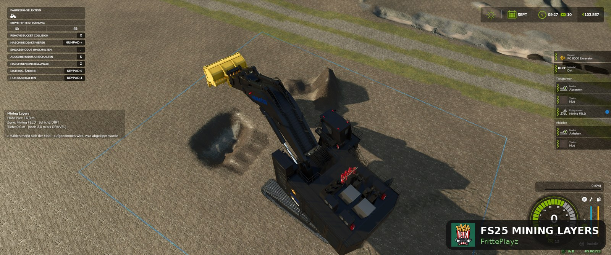
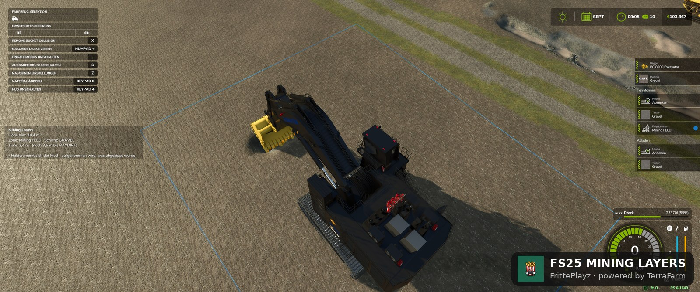
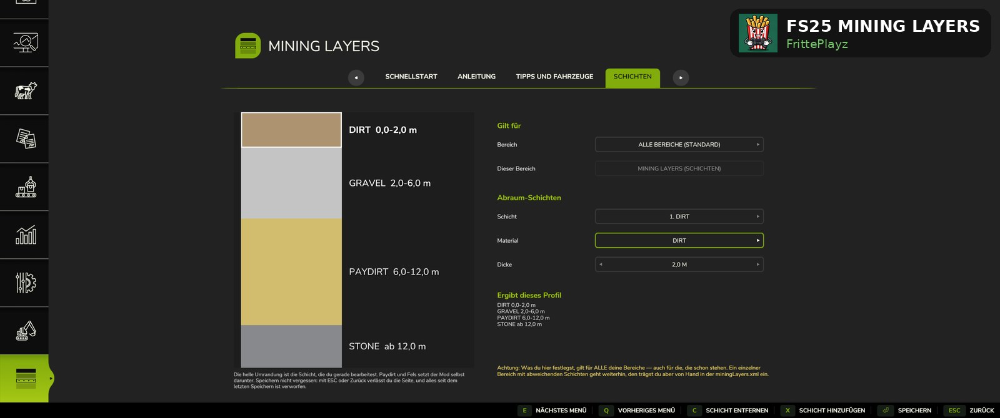
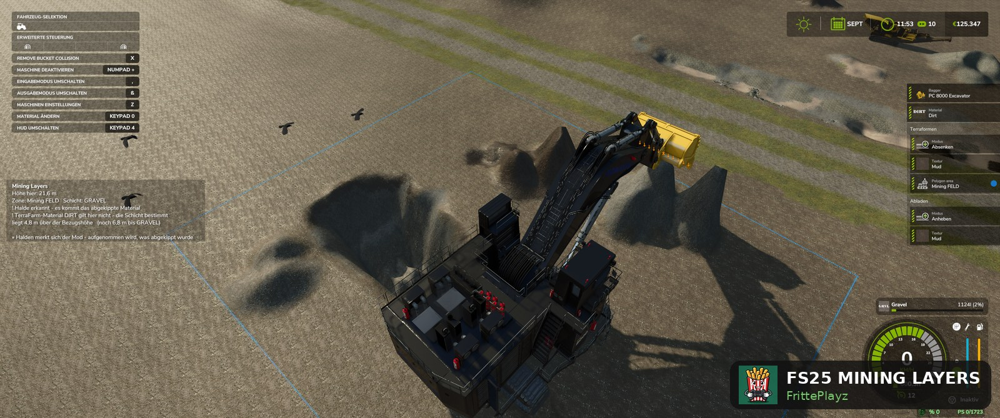
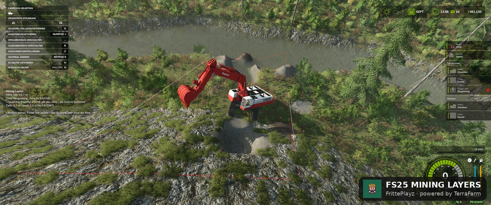
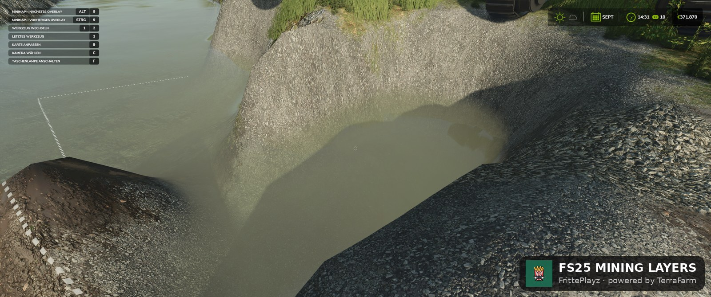

# Mining Layers (FS25)

**Echtes Bergbau-Gameplay für den Landwirtschafts-Simulator 25 — grab dich durch geologische Schichten.**
Das Material bestimmt die Grabtiefe, nicht die Handauswahl: erst Mutterboden, dann Kies, dann Paydirt, dann Fels. Eigene Geologie pro Grube, Halden mit Gedächtnis und ein Ingame-Editor. Läuft auf **jeder Karte** — ohne Map-Bearbeitung.

Mining Layers baut auf **[TerraFarm](https://github.com/scfmod/FS25_TerraFarm)** von scfmod auf und benötigt es zum Laufen. Inoffizielles Addon, keine Verbindung zu scfmod.

🇬🇧 **English version: [README.md](README.md)**

---

## Voraussetzungen — zuerst lesen

1. **TerraFarm** — gibt es **nur auf GitHub**: [scfmod/FS25_TerraFarm](https://github.com/scfmod/FS25_TerraFarm).
   ⚠️ Den Ordner **nicht umbenennen** — er muss `FS25_0_TerraFarm` heißen (Ladereihenfolge).
2. **Mindestens eine Maschine mit TerraFarm-Config** — TerraFarm arbeitet nur mit Maschinen, die eine Machine-Konfiguration haben.
3. Empfohlen (kein Muss): eine Bergbau-Karte wie **Yukon (RGC)**. Mining Layers macht aber *jede* Karte zur Mining-Karte, auch Standard-Maps.

## Installation

1. Neuestes `FS25_MiningLayers.zip` aus den [Releases](../../releases) laden.
2. Die **ZIP-Datei unverändert** (nicht entpacken!) in den Mods-Ordner legen:
   - **Windows:** `Dokumente\My Games\FarmingSimulator2025\mods\`
   - **Steam unter Linux (Proton):** im Proton-Prefix — `steamapps/compatdata/<FS25-AppID>/pfx/drive_c/users/steamuser/Documents/My Games/FarmingSimulator2025/mods/`
3. Sicherstellen, dass [TerraFarm](https://github.com/scfmod/FS25_TerraFarm) (`FS25_0_TerraFarm`) im selben Ordner liegt.
4. Spiel starten und **beide Mods** in der Mod-Auswahl des Spielstands anhaken.

Nach dem Start findest du eine neue Seite **Mining Layers** im ESC-Menü — mit der kompletten Anleitung direkt im Spiel:

## Schritt für Schritt: deine erste Grube

**1. TerraFarm-Bereich (Polygon) um die geplante Grube ziehen.** Das ist die ganze Einrichtung — die Bezugshöhe holt sich der Mod automatisch vom Gelände am Bereichsrand:

**2. Losgraben.** Das Mining-Layers-Panel links zeigt Zone, aktuelle Schicht, Tiefe — und wie weit es bis zur nächsten Schicht ist:

**3. Tiefer graben: Mutterboden → Kies → Paydirt → Fels.** Der Grubenboden stoppt automatisch unter der letzten Schicht:

**4. Eigene Schichten festlegen — pro Grube.** ESC-Menü → Mining Layers → Reiter Schichten. Unter *Gilt für* wählst du das Ziel: alle Bereiche oder eine bestimmte Grube — und ob diese Grube überhaupt mit Schichten arbeitet. Darunter stellst du Material und Dicke je Schicht ein, links siehst du das entstehende Profil sofort:

**5. Halden merken sich ihr Material.** Kies abkippen, Kies wiederaufnehmen — auch an den Flanken. Das Panel sagt dir, wenn das Halden-Gedächtnis greift. Kein Material-Cheaten: unter der Haldenbasis ist wieder Geologie:

**6. Bergbau am Berg lohnt sich.** Am Steilhang liegt Paydirt oberflächennah — die Belohnung für die Anfahrt:

**7. Die Grenzen kennen.** Gruben an der Wasserlinie laufen optisch voll (perfekt fürs Goldwaschen-Gefühl); manche Karten sperren Flussbett und Kartenrand komplett:

## ⚠️ Zwei Wege je Bereich — lesen, bevor du den Mod für kaputt hältst

Der häufigste Verwirrungspunkt überhaupt. Im TerraFarm-Menü → **Landscaping areas** → Bereich auswählen gibt es **zwei Materialfelder**: **Terraformen** und **Abladen** (gesetzt über *Material ändern*). Beide stehen ab Werk auf **„Not set"**.

1. **Beide Felder auf „Not set"** → Mining Layers arbeitet: Was in der Schaufel landet, hängt an der Grabtiefe. **Das ist der Auslieferungszustand eines frisch gezogenen Bereichs** — du musst nichts tun.
2. **Beim *Terraformen* ein Material eintragen** → der Bereich läuft als ganz normale TerraFarm-Polygon-Area ohne Schichten. Genau richtig für Baustellen, Straßenbau, Planieren — überall, wo du immer dasselbe Material brauchst.
3. Dasselbe geht über den **Reiter Schichten** von Mining Layers: Bereich wählen und auf „Normales TerraFarm" stellen. Beides führt zum gleichen Ergebnis.
4. **Pfad-Bereiche sind komplett ausgenommen** — Schichten gibt es ausschließlich in Polygon-Bereichen. Ein Pfad-Bereich verhält sich immer wie normales TerraFarm, egal was eingestellt ist.

Das ist **kein Defekt und kein Mod-Konflikt — es ist die vorgesehene Umschaltung.** Liefert eine Zone „das falsche Material", zuerst die Materialfelder des Bereichs prüfen.

## Features

- **Material nach Grabtiefe** — Schichtgrenzen in Metern unter der ursprünglichen Oberfläche
- **Geologie pro Grube** — jeder TerraFarm-Bereich kann seinen eigenen Schichtaufbau haben (verschiedene Gruben, verschiedene Materialien, eine Karte)
- **Pro Grube eigene Geologie oder ganz normales TerraFarm** — Zielbereich im Editor wählen und je Grube entscheiden
- **Halden-Gedächtnis** — was du abkippst, nimmst du auch wieder auf. Kein Material-Cheaten: Wer eine Halde unter ihre Basis durchgräbt, trifft wieder auf Geologie (Krater-Cheat-Sperre inklusive)
- **Automatischer Grubenboden** — Zieltiefe = unterste Schichtgrenze, zieht bei Bereichs-Änderungen nach
- **Hang- und Wasser-Behandlung** — geneigte Bezugsfläche am Hang, Grubenboden klemmt an der Wasserlinie
- **Eigene Menüseite** — grafischer Schichten-Editor plus vollständige Ingame-Doku (Deutsch + Englisch)
- **Tiefenanzeige & Tiefenlinien** — du weißt immer, wie tief du bist und was als Nächstes kommt
- **Material-Check beim Start** — warnt vor der 63-Materialien-Grenze der Engine
- **Berg-Bonus** — am Steilhang liegt Paydirt oberflächennah: Wer die Anfahrt auf sich nimmt, wird belohnt
- Multiplayer-freundliches Sponsorschild (siehe unten), kein Sync-Verkehr

## Fallstricke, die man kennen sollte

- **63 Gelände-Materialien sind ein hartes Engine-Limit.** Basisspiel + Karte + Mods teilen es sich; zusätzliche Filltype-Mods können rausfliegen. Der Start-Check sagt dir, wo du stehst.
- **Absenken geht nur innerhalb des Polygons** (TerraFarm-Design). Ein Radlader schafft nur ~30–40 cm pro Ansatz — Rampe in die Grube fahren; der Bagger ist das Tiefen-Werkzeug.
- **Eine Hangflanke pro Bereich.** Bereiche über einen Bergkamm oder weit in einen See spannen die Bezugsebene falsch — Ufer-Bereiche hauptsächlich über Land ziehen.
- **Manche Karten sperren Terraforming** an Flussbett und Kartenrand (Engine-Sperrflächen). Da kommt kein Mod durch.
- Die Terrain-Texturnamen zur Laufzeit sind andere als in der `map.i3d` — der Mod löst das automatisch; pro Schicht per `paintLayer="..."` übersteuerbar.

## Konfiguration

`modSettings/FS25_MiningLayers/miningLayers.xml` — wird beim ersten Start aus der Vorlage angelegt und überlebt Mod-Updates. Schichtaufbau (Material + Tiefe, pro Bereich), Anzeige-Optionen und der Sponsorschild-Schalter stehen hier. Alles auch über das Ingame-Menü editierbar.

## Sponsor

Mining Layers wird unterstützt von **[farmersingles.de](https://farmersingles.de)** — der Singlebörse für Landwirte. 🚜❤️
Im Spiel zeigt sich das als kleines Schild am Grubenrand. Nicht gewünscht? `sponsorSign="false"` in der Config — das Schild verschwindet sofort, ohne Neustart.

## Credits

- **Autor:** Tommy Honold — [seeside.ai](https://seeside.ai)
- **Sponsor:** [farmersingles.de](https://farmersingles.de) — die Singlebörse für Landwirte
- Ein **FrittePlayz**-Projekt (YouTube)
- Baut auf **[TerraFarm](https://github.com/scfmod/FS25_TerraFarm)** von scfmod auf (wird benötigt, separat installieren) — inoffizielles Addon, keine Verbindung zu scfmod oder GIANTS Software.

## Fehler & Fragen

Fehler gefunden? [Issue aufmachen](../../issues) — bitte mit `log.txt` und der gespielten Karte. Feature-Ideen sind an derselben Stelle willkommen.

## Unterstütz den Mod 🍟

  

Mining Layers ist kostenlos und bleibt es — keine Paywall, keine Vorabversionen gegen Geld, keine Werbung.

Dahinter stecken viele Abende: TerraFarms Quelltext lesen, Testgruben ausheben und Fehler jagen, die erst beim fünften Neuladen auftauchen. Wenn dir der Mod einen guten Nachmittag in der Grube gemacht hat, **[spendier mir eine Portion Pommes](https://buymeacoffee.com/fritteplayz)** — die fließt direkt in Testzeit und neue Features.

Nicht dein Ding? Ein ⭐ auf dieses Repo, ein Fehlerbericht oder eine Empfehlung an einen Kumpel helfen genauso. Danke fürs Spielen!
