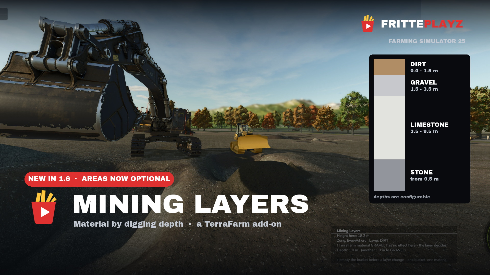

# Mining Layers (FS25)

**Du vrai gameplay minier pour Farming Simulator 25 — creuse à travers des couches géologiques, ou crée ta propre gravière dans FS25.**
Le matériau dans ton godet dépend de la profondeur, pas d'un menu déroulant : terre végétale d'abord, puis gravier, puis le filon, socle rocheux en bas. Depuis la 1.4.0 le filon est sélectionnable — mine de charbon, gravière ou carrière de calcaire, sur n'importe quelle carte, sans édition de carte. **Le mod et son manuel en jeu existent intégralement en français** (traduction automatique — corrections bienvenues !).

🇬🇧 [English](README.md) · 🇩🇪 [Deutsch](README.de.md) · 🇵🇱 [Polski](README.pl.md) — *page FR compacte ; la documentation détaillée vit dans la version anglaise, le manuel complet est en jeu, en français.*

---

## ⛏️ D'abord : ta carte décide des matériaux

Qu'un matériau existe — et que tu puisses le redéverser au sol — ne dépend pas de ce mod, mais de ta carte et de ta liste de mods. Parmi les matériaux miniers, le jeu de base ne connaît que STONE : DIRT, GRAVEL, SAND, COAL, LIMESTONE et PAYDIRT viennent toujours de cartes ou de mods. S'ajoute une limite stricte du jeu : seuls 63 matériaux peuvent se trouver au sol en même temps, et le jeu de base en occupe déjà 48. Sur de grandes listes de mods, les dernières places partent vite — tu peux alors encore creuser, transporter et vendre un matériau, mais plus le déverser.

Mining Layers emprunte donc une voie médiane pour rester jouable sur chaque carte : au chargement, le mod vérifie une fois ce que TA carte fournit réellement et ne propose que cela dans le sélecteur de couches (depuis la 1.5.0). Un `(!)` derrière un nom signifie : creuser, transporter et vendre fonctionnent, déverser non sur cette carte. Ce qui manque totalement est indiqué sous la coupe. Tu n'as donc aucune carte à tester au préalable — s'il manque quelque chose, c'est la carte, pas le mod.

**À retenir : moins de mods = plus de places libres = plus de matériaux déversables.** Si un matériau qui te manque porte un `(!)`, une seule solution : retirer les mods qui apportent leurs propres matériaux de sol. La limite de 63 elle-même ne peut pas être relevée, elle est figée dans le jeu.

## Prérequis

- **[TerraFarm](https://github.com/scfmod/FS25_TerraFarm)** de scfmod — disponible sur GitHub uniquement. Ne renomme pas son dossier : il doit rester `FS25_0_TerraFarm` (ordre de chargement).
- Au moins **une machine avec une configuration TerraFarm** (par ex. l'officiel `FS25_TerraFarmMachines`).
- **PC ou Mac uniquement** — mod script, les consoles ne les acceptent pas.

Addon non officiel, aucune affiliation avec scfmod ni GIANTS. Aucun fichier TerraFarm n'est livré.

## Installation

1. Télécharge TerraFarm (lien ci-dessus).
2. Télécharge `FS25_MiningLayers.zip` depuis les [releases](https://github.com/FrittePlayz/FS25_MiningLayers/releases).
3. Mets les deux ZIP — tels quels, sans les décompresser — dans ton dossier mods :
   `Documents\My Games\FarmingSimulator2025\mods\`
4. Active les DEUX mods dans la sélection de mods de ta sauvegarde.

## Première fosse en une étape

Trace une zone TerraFarm (polygone) autour de ta future fosse et **laisse les champs de matériau vides**. C'est tout : creuse n'importe où dans la zone et le matériau vient de la profondeur. La hauteur de référence se calcule toute seule à partir du contour.

Réglages et couches : menu ESC → Mining Layers. Le manuel complet y est aussi, en français.

## Géologie personnalisée — gravière, mine de charbon

Depuis la 1.4.0, le filon se choisit dans l'éditeur (ESC → Mining Layers → Couches) : le filon est la dernière ligne, fixe — prends COAL pour une mine de charbon, LIMESTONE ou STONE pour une gravière, ou GRAVEL, SAND, DIRT, SOIL. PAYDIRT reste la valeur par défaut. Le socle rocheux en dessous termine la fosse — c'est voulu.

À savoir : parmi les matériaux du mod, seul STONE est enregistré dans le jeu de base — DIRT, SOIL, GRAVEL, SAND, COAL, LIMESTONE et PAYDIRT doivent venir de ta carte ou d'autres mods (les cartes de chantier et minières comme celles de RGC apportent les plus courants).

## Épaisseur des couches

Au moins 1,5 m par couche (l'éditeur impose 1 m pour la couche du haut, 1,5 m en dessous) — plus fin, la reprise des tas casse. **Avec de grosses machines type PC 8000, 2 m par couche tourne nettement mieux.**

## FAQ

**Mining Layers fonctionne-t-il sur n'importe quelle carte ?**
Oui. Aucune édition de carte : trace une zone TerraFarm autour de ta fosse et creuse. Pour les textures, le mod prend automatiquement le sol le plus proche que la carte propose ; si rien ne convient, ta propre sélection reste simplement active.

**Faut-il une nouvelle sauvegarde ?**
Non. Mining Layers fonctionne avec les sauvegardes existantes — installe, active les deux mods dans ta sauvegarde et continue de jouer. Les zones TerraFarm existantes continuent de fonctionner ; les zones sans matériau renseigné reçoivent simplement des couches.

**Comment faire une gravière dans FS25 ?**
Installe TerraFarm et Mining Layers, trace une zone, puis menu ESC → Mining Layers → Couches : DIRT en haut, LIMESTONE ou STONE comme filon. Depuis la 1.4.0, tout se règle dans l'éditeur — sans XML.

**Comment extraire du charbon dans FS25 ?**
Choisis COAL comme filon dans l'éditeur. Attention : COAL n'est pas un matériau du jeu de base — ta carte ou un mod minier doit le fournir.

**Mining Layers ajoute-t-il un matériau paydirt à ma carte ?**
Non — le mod n'enregistre jamais de matériaux. Il utilise uniquement ce que le jeu de base, ta carte et tes autres mods fournissent déjà. PAYDIRT n'est pas un matériau du jeu de base : les cartes et mods miniers l'apportent, c'est pourquoi il est souvent là quand même. Pas de paydirt ? Choisis dans l'éditeur un filon que ta carte connaît — le log les liste tous au démarrage.

**Puis-je définir mes propres couches — plus de terre, différents types de sol ?**
Oui, c'est le cœur du mod. Menu ESC → Mining Layers → Couches : pour chaque fosse tu choisis le matériau ET l'épaisseur de chaque couche de découverte. Plus de terre ? Passe la couche DIRT à 4 m au lieu de 2. De la variété ? Empile DIRT sur SOIL sur gravier. Tout matériau connu de ta carte fonctionne, et le filon du bas est lui aussi sélectionnable. Minimums : 1 m en haut, 1,5 m en dessous (2 m creuse mieux avec les grosses machines).

**Pourquoi ma pelle ne creuse-t-elle pas ?**
TerraFarm a besoin d'une configuration machine pour ce véhicule — sans elle, rien ne se passe (ce n'est pas un problème de Mining Layers). Installe un pack de configs comme FS25_TerraFarmMachines, et évite les entrées en double venant de plusieurs packs.

**Pourquoi j'obtiens toujours le même matériau, quelle que soit la profondeur ?**
Un matériau est renseigné sur ta zone TerraFarm — la zone passe alors en TerraFarm classique sans couches (voulu, pour les chantiers). Laisse les champs de matériau vides et les couches prennent le relais.

**Pourquoi n'ai-je pas de couches alors que j'ai tracé une zone ? (top 3 des causes)**
1. **La machine n'a pas de zone d'entrée assignée.** TerraFarm lie les zones à la MACHINE, pas à ta position : réglages machine (`Y` par défaut) → choisis ta zone comme entrée. Sauvegardé par machine et par partie — le cas de support n° 1 ; le HUD TerraFarm affiche alors ta zone au lieu d'un simple matériau.
2. **Un matériau est renseigné dans la zone** → la zone fonctionne volontairement en TerraFarm classique (mode chantier). Laisse les champs de matériau vides.
3. **Tu creuses en dehors du polygone** (ou dans une zone chemin — les chemins n'ont jamais de couches).

**Jusqu'où peut-on creuser ?**
Jusqu'au socle rocheux sous ta couche la plus profonde — là, ça s'arrête volontairement. C'est ce qui en fait du minage et pas un trou à argent sans fond.

**Quelle épaisseur pour mes couches ?**
Au moins 1,5 m (l'éditeur impose 1 m en haut, 1,5 m en dessous). Avec de grosses machines type PC 8000, 2 m par couche creuse nettement mieux.

**Y a-t-il une limite de tas — combien puis-je déverser ?**
Non. Le matériau déversé devient du vrai terrain via TerraFarm, pas un tas du jeu de base — aucune limite de capacité ne s'applique. La mémoire des tas est une grille de 2 m par sauvegarde, sans plafond de nombre ni de taille. À savoir : chaque cellule de 2 m retient UN matériau (le dernier déversement gagne) — ne mélange pas les matériaux au même endroit si tu veux les récupérer séparément.

**Décharger au sol affiche « action impossible » ?**
TerraFarm vérifie à la verticale sous le bord du godet : si le terrain est à moins d'environ 0,5 m, le déchargement au sol est bloqué (protection de la posture de creusage). Ce qui compte, c'est la distance sous le bord, pas la hauteur de la flèche — au-dessus d'un creux déjà excavé ça marche même flèche basse ; sur sol plat, lève brièvement jusqu'à ce que le message disparaisse. Il y a aussi une limite vers le haut : le déversement doit encore toucher le sol. Donc : bord dégagé d'un bon demi-mètre, mais assez bas pour déverser.

**Le matériau reste dans le godet mais ne se déverse pas au sol ?**
FS25 limite les matériaux pouvant reposer au sol (height types) à 63 — jeu de base, carte et tous les mods se partagent ce quota, et le jeu de base en occupe déjà 48 à lui seul ; carte et mods se disputent les 15 restants. Quand il est plein, les matériaux enregistrés en dernier perdent leur place : ils fonctionnent dans le godet et se vendent, mais ne se déversent pas sur le terrain. Le log montre alors `maximum number (63) of height types already registered`, et depuis la 1.4.2 le mod avertit par zone quand un matériau de couche est touché. Seul remède : alléger les mods riches en matériaux.

**Pourquoi ma machine ne décharge que dans une zone — ou nulle part ?**
Une zone de sortie est assignée dans le menu machine : TerraFarm ne décharge alors que dedans. Depuis la 1.4.2, une zone de couches assignée en sortie tourne automatiquement en libre (une ligne de log le confirme). Pour décharger librement partout, mets la zone de sortie de la machine sur « non définie ».

**Comment masquer (ou réafficher) l'affichage de profondeur ?**
Appuie sur **Pavé num. 5** quand une machine est active (depuis la 1.4.1). Touche réassignable : Options → Commandes → Mining Layers. Pour démarrer sans affichage : `showHeightDisplay="false"` dans `modSettings/FS25_MiningLayers/miningLayers.xml`.

**Puis-je déplacer l'affichage pour éviter les conflits avec d'autres HUD ?**
Oui — depuis la 1.4.2, appuie sur **Pavé num. *** (réassignable) : clique l'affichage pour le prendre, reclique pour le poser, clic droit remet à la position par défaut. La position s'enregistre automatiquement (dans `modSettings/FS25_MiningLayers/hud.xml`). Aucun mod HUD supplémentaire nécessaire.

**Ça tourne sur PS5 ou Xbox ?**
Non. Mining Layers est un mod script, et les mods script ne tournent que sur PC/Mac.

**Quelles langues sont disponibles ?**
Français, anglais, allemand et polonais — manuel en jeu complet inclus.

**C'est vraiment gratuit ?**
Oui. Téléchargement gratuit sur GitHub, pas de paywall, pas d'accès anticipé. Pour dire merci : [offre-moi des frites](https://buymeacoffee.com/fritteplayz). 🍟

## Traduction

Cette page et les textes en jeu FR sont traduits automatiquement — les corrections de francophones sont très bienvenues : ouvre une [issue](https://github.com/FrittePlayz/FS25_MiningLayers/issues) ou une pull request (les fichiers de langue sont du simple XML dans `l10n/`), et tu seras crédité.

## Bugs et questions

[GitHub Issues](https://github.com/FrittePlayz/FS25_MiningLayers/issues) — **joins toujours ton `log.txt`** (`Documents/My Games/FarmingSimulator2025/log.txt`, copié juste après le problème). Il contient ta liste de mods et l'erreur réelle — sans lui, on ne peut généralement pas aider.

## Sponsor

Ce mod est soutenu par [farmersingles.de](https://www.farmersingles.de), un site de rencontre pour agriculteurs — d'où le petit panneau au coin de chaque zone. `sponsorSign="false"` dans `miningLayers.xml` et il disparaît ; rien d'autre ne change.

*Mining Layers par Tommy Honold, Farmersingles.de. Un projet [FrittePlayz](https://www.youtube.com/@FrittePlayz). Gratuit, et ça le restera.*
