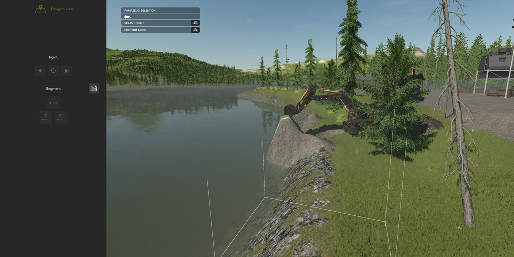
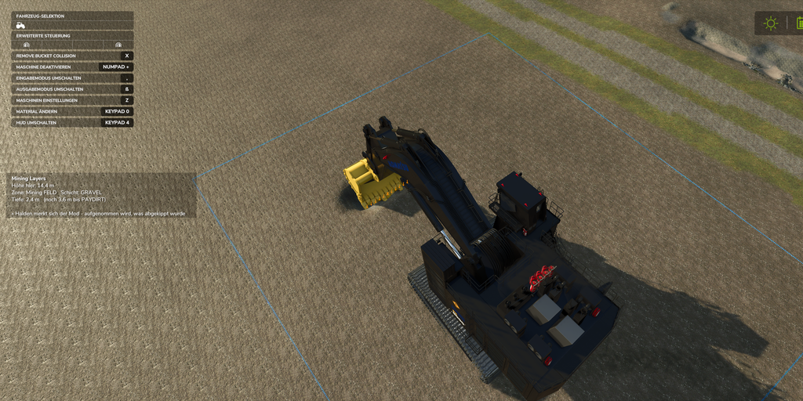
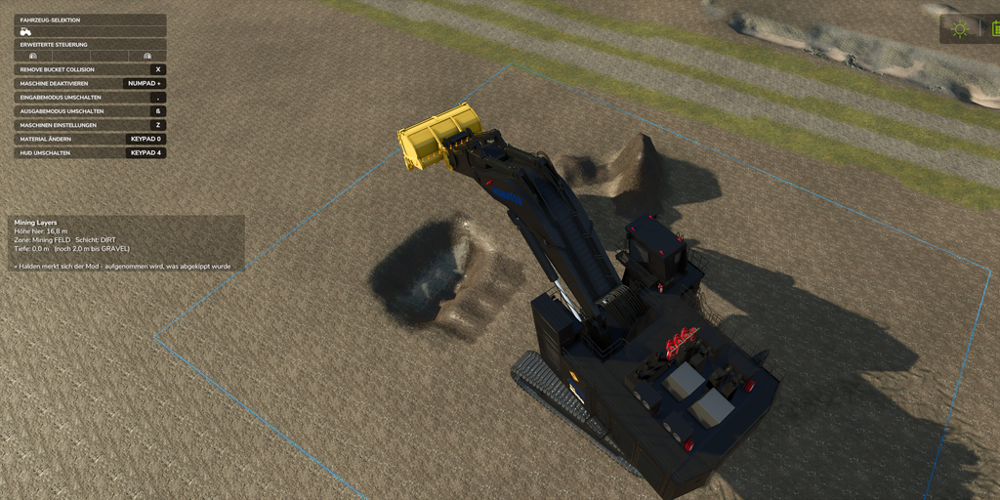
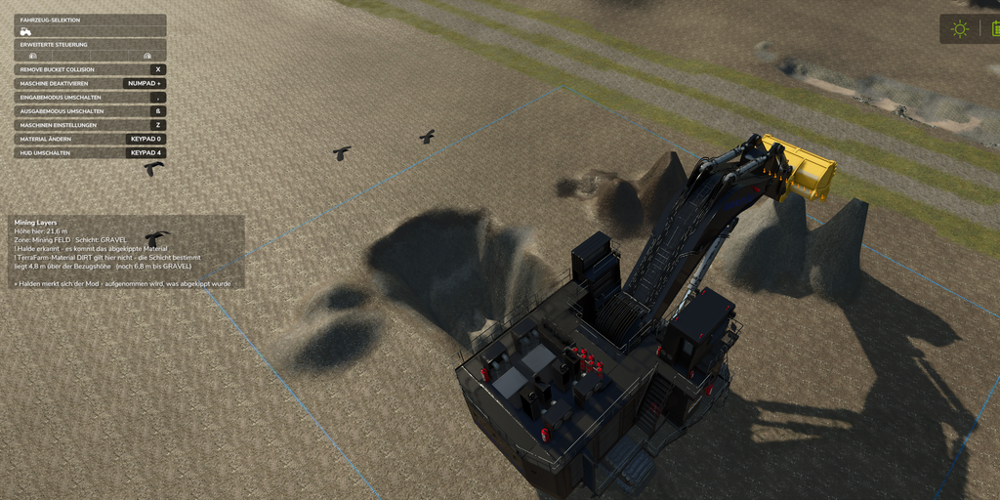
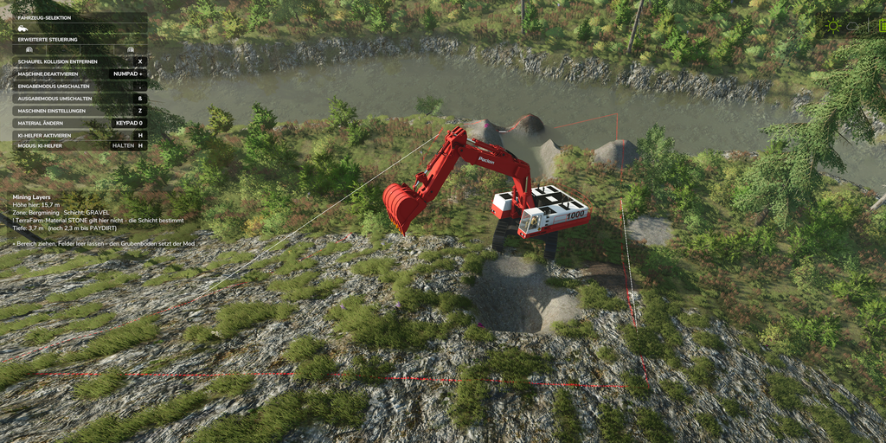
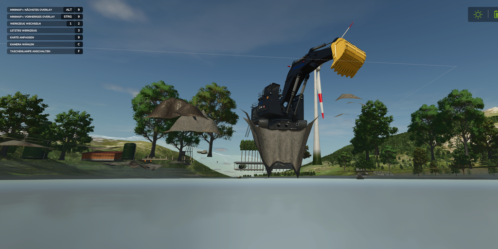

# Mining Layers (FS25)

**Real mining gameplay for Farming Simulator 25 — dig through geological layers.**
Material is determined by digging depth, not by hand selection: topsoil first, then gravel, then paydirt, then rock. Per-pit geology, spoil piles that remember what you dumped, and an in-game editor. Works on **any map** — no map editing required.

An unofficial add-on **powered by [TerraFarm](https://github.com/scfmod/FS25_TerraFarm)** (by scfmod — no affiliation).

🇩🇪 **Deutsche Version: [README.de.md](README.de.md)**

---

## Requirements — read this first

1. **TerraFarm** — available **only on GitHub**: [scfmod/FS25_TerraFarm](https://github.com/scfmod/FS25_TerraFarm).
   ⚠️ Do **not** rename its folder — it must stay `FS25_0_TerraFarm` (load order).
2. **At least one machine with a TerraFarm config** — TerraFarm only works with machines that have a machine configuration.
3. Recommended (not required): a mining map like **Yukon (RGC)**. Mining Layers turns *any* map into a mining map, including stock maps.

## Installation

1. Download the latest `FS25_MiningLayers.zip` from [Releases](../../releases).
2. Put the **ZIP file as-is** (do not unpack!) into your mods folder:
   - **Windows:** `Documents\My Games\FarmingSimulator2025\mods\`
   - **Steam on Linux (Proton):** inside the Proton prefix — `steamapps/compatdata/<FS25-AppID>/pfx/drive_c/users/steamuser/Documents/My Games/FarmingSimulator2025/mods/`
3. Make sure [TerraFarm](https://github.com/scfmod/FS25_TerraFarm) (`FS25_0_TerraFarm`) is in the same folder.
4. Start the game and enable **both mods** in the mod selection of your savegame.

## Quick start

1. Install as above — TerraFarm first, then Mining Layers.
2. In game: draw a **TerraFarm area** (polygon) around your future pit. That's it — the mod takes the reference height automatically from the terrain at the area's edge.
3. Start digging: topsoil → gravel → paydirt → rock. The layer display on the left shows current depth and what comes next.
4. Change the layers via the **ESC menu → Mining Layers** (graphical editor, per pit) — or edit `modSettings/FS25_MiningLayers/miningLayers.xml` by hand.

## Features

- **Material by digging depth** — layer boundaries in meters below the original surface
- **Per-pit geology** — every TerraFarm area can have its own layer stack (different pits, different materials, one map)
- **Spoil pile memory** — what you dump is what you pick back up. No material cheating: dig a pile below its base and you hit geology again (crater-cheat protection included)
- **Automatic pit floor** — target depth is set to the lowest layer boundary, follows area changes
- **Slope & water handling** — tilted reference plane on hillsides, pit floor clamps to the waterline
- **In-game menu page** — graphical layer editor plus full documentation (English + German)
- **Depth display & depth lines** — always know how deep you are and what comes next
- **Material check at startup** — warns about the engine's 63 terrain material limit
- **Mountain bonus** — on steep slopes paydirt sits near the surface: hauling up the mountain gets rewarded
- Multiplayer-friendly sponsor sign (see below), no sync traffic

## How it looks

| | |
|---|---|
|  *Draw a TerraFarm area — done* |  *Depth display: layer, depth, what's next* |
|  *Layers visible in the pit wall* |  *Spoil piles remember their material* |
|  *Mountain bonus: paydirt near the surface* |  *Digging below the waterline works* |

## Pitfalls worth knowing

- **63 terrain materials is a hard engine limit.** Base game + map + mods share it; additional fill type mods may get kicked out. The startup check tells you where you stand.
- **Lowering only works inside the polygon** (TerraFarm design). A wheel loader only cuts ~30–40 cm per pass — drive a ramp into the pit; the excavator is the depth tool.
- **One slope face per area.** Areas drawn across a ridge or far into a lake stretch the reference plane — draw shoreline areas mostly over land.
- **Some maps block terraforming** at riverbeds and map edges (engine blocked-area map). No mod can dig there.
- Runtime terrain texture names differ from the names in `map.i3d` — the mod resolves this automatically; override per layer via `paintLayer="..."` if you want a specific look.

## Configuration

`modSettings/FS25_MiningLayers/miningLayers.xml` — created from the template on first start, survives mod updates. Layer stacks (material + depth, per area), display options, and the sponsor sign toggle live here. Everything can also be edited from the in-game menu.

## Sponsor

Mining Layers is supported by **[farmersingles.de](https://farmersingles.de)** — the dating site for farmers. 🚜❤️
In game this shows as a small sign at the pit edge. Don't want it? Set `sponsorSign="false"` in the config — it disappears immediately, no restart needed.

## Credits

- **Author:** Tommy Honold — [seeside.ai](https://seeside.ai)
- **Sponsor:** [farmersingles.de](https://farmersingles.de) — the dating site for farmers
- A **FrittePlayz** project (YouTube)
- Powered by **TerraFarm** by [scfmod](https://github.com/scfmod) — this is an unofficial add-on with no affiliation to scfmod or GIANTS Software.

## Support

Found a bug? [Open an issue](../../issues) — include your `log.txt` and the map you play on.
